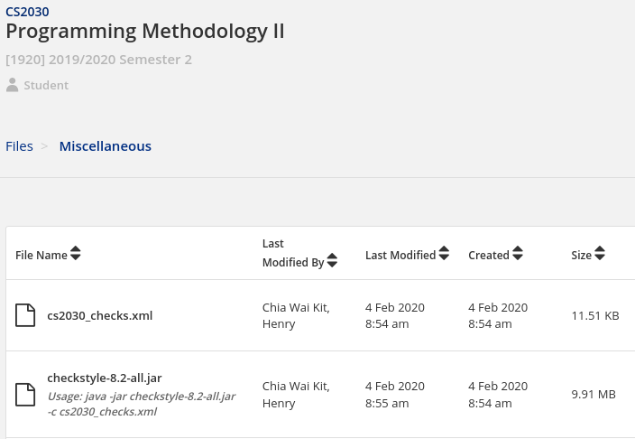
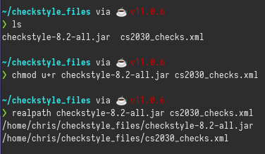
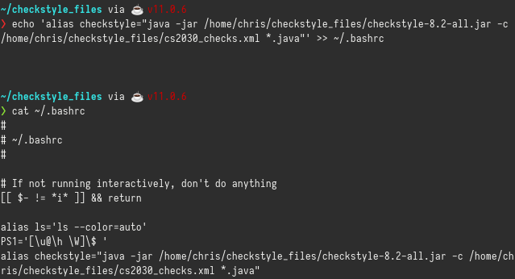
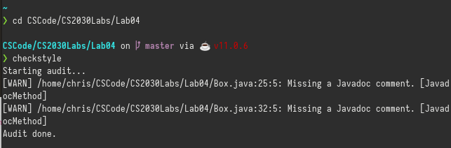

<frontmatter>
  pageNav: 2
  header: header.md
  footer: footer.md
  siteNav: site-nav.md
</frontmatter>

 

# Setting Up Checkstyle

 

 

1) Go to CS2030 Luminus and download the 2 files under Files > Miscellaneous:
 - `checkstyle-8.2-all.jar` - this provides the actual checkstyle program
 - `cs2030_checks.xml` - this provides the configuration file specifically for CS2030 for checkstyle

Make sure you save them to a directory that you can remember. In this case, I chose to save them to `~/checkstyle_files`.

 

2) In the shell, change directory to the folder where you saved the files, with `cd /place/where/you/saved/the/files`.

3) Check that the files are there with `ls`.

4) Your download files should already have the right read permissions, but we will set it again just to be sure. Run `chmod u+r checkstyle-8.2-all.jar cs2030_checks.xml`. What this command does is that it **CH**anges the **MOD**e of the files (i.e. its permissions), and adds **r**ead (`+r`) to the **u**ser (`u+r`).

5) To help us accurately determine the location of the files later, run `realpath -e checkstyle-8.2-all.jar cs2030_checks.xml` (yes I missed out the `-e` switch in the screenshot above). `realpath` outputs the full absolute file path while the `-e` switch ensures it checks for file existence first.

 

6) Now that we know the absolute location of the two files, we can create our very own `checkstyle` command. Run, in a single command, `echo 'alias checkstyle="java -jar your/full/filepath/here/checkstyle-8.2-all.jar -c your/full/filepath/here/cs2030_checks.xml *.java"' >> ~/.bashrc`.
* remember to swap out the directories in the command above with your actual directories you found in step 5
* make sure you have TWO right brackets `>>` instead of one. the two right brackets ensures it appends to the `~/.bashrc` file instead of rewriting it.
* if you use any other shell like `zsh` or `fish`, please change the command to work with your respective shell configuration files, e.g. `~/.zshrc`

For me, I ran `echo 'alias checkstyle="java -jar /home/chris/checkstyle_files/checkstyle-8.2-all.jar -c /home/chris/checkstyle_files/cs2030_checks.xml *.java"' >> ~/.bashrc`.

What this command does is that it appends the line `alias checkstyle="java -jar /home/chris/checkstyle_files/checkstyle-8.2-all.jar -c /home/chris/checkstyle_files/cs2030_checks.xml *.java"` to the end of your shell configuration file (commonly `~/.bashrc`). Your shell configuration file is ran (or more accurately, sourced) whenever you start your shell.

As for `alias checkstyle="java -jar /home/chris/checkstyle_files/checkstyle-8.2-all.jar -c /home/chris/checkstyle_files/cs2030_checks.xml *.java"`, what this does is that it sets a command alias called `checkstyle`, so that whenever you run `checkstyle` in your shell, it will run `java -jar /home/chris/checkstyle_files/checkstyle-8.2-all.jar -c /home/chris/checkstyle_files/cs2030_checks.xml *.java`, which is the command to properly run checkstyle and load the configuration file in java.

7) Restart your shell, i.e. close it and start it again. (alternatively, you can just run `source ~/.bashrc`)

8) Change directory to a directory with `.java` files and run `checkstyle`. It should work now.

 

 

