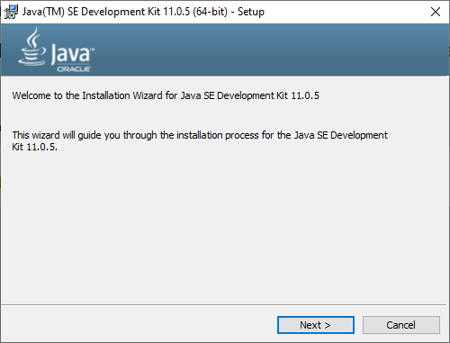
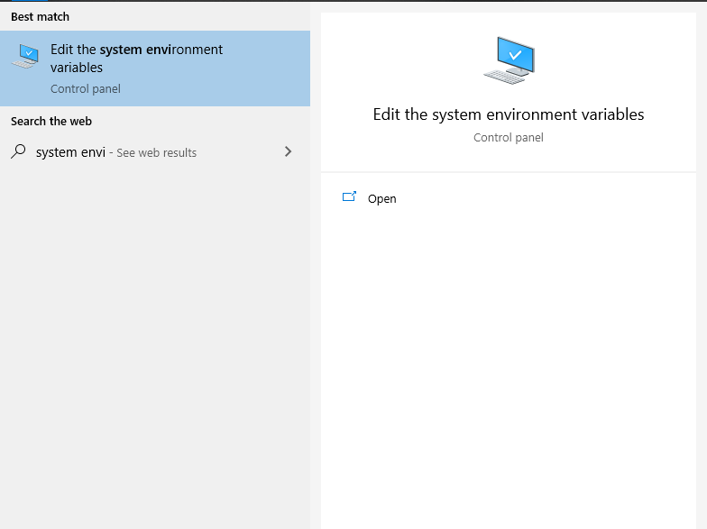
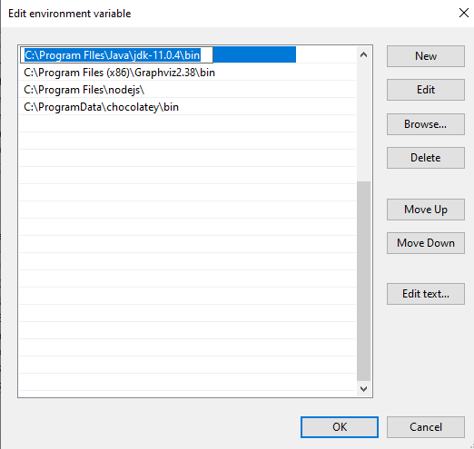
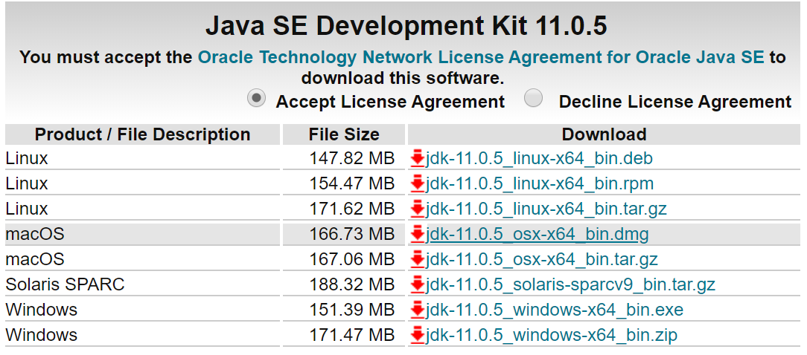

<frontmatter>
  pageNav: 2
  header: header.md
  footer: footer.md
  siteNav: site-nav.md
</frontmatter>

<br> 

# Setting Up Java

<br>

We will mainly be using JDK 11 for CS2030. 

<panel header="## For Windows Users" no-close>

1) To download the jdk version 11 installer, go to the link [here](https://www.oracle.com/technetwork/java/javase/downloads/jdk11-downloads-5066655.html)


2) Open the exe file and run the installation, accepting all default configurations. 



3) Following which, you need to edit your environment variables 



4) Click on Environment Variables.


5) Under System Variables, go to PATH and click Edit. 


6) Finally, add a new Environment Variable which links to the bin folder of the jdk folder in your Program Files. <br />
Once you are done, click OK. 



7) To make sure you have jdk installed properly, you can run ```javac --version``` on your terminal. 


</panel>

<panel header="## For MacOS Users" no-close>

1) To download the jdk version 11 installer, go to the link [here](https://www.oracle.com/technetwork/java/javase/downloads/jdk11-downloads-5066655.html)



2) Open the dmg file and run the installation, accepting all default configurations. 


</panel>
