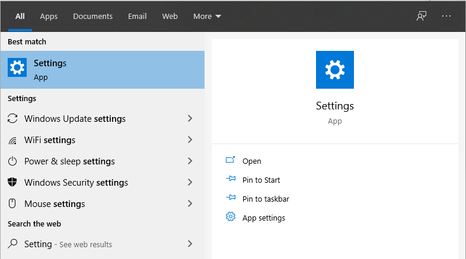
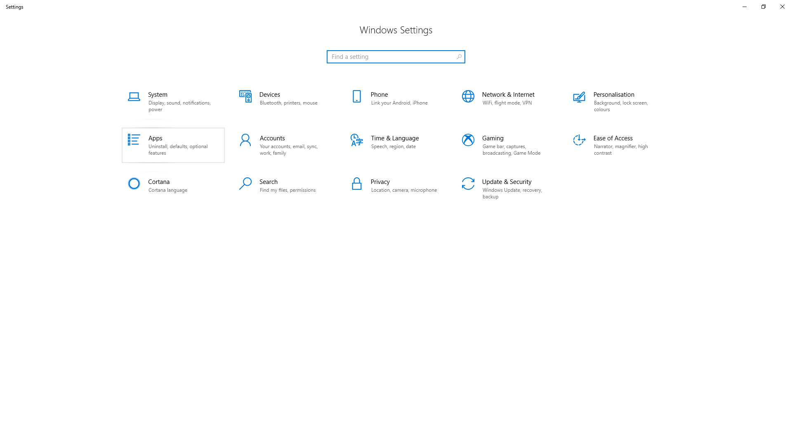
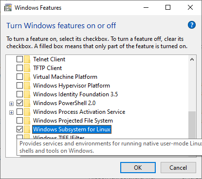
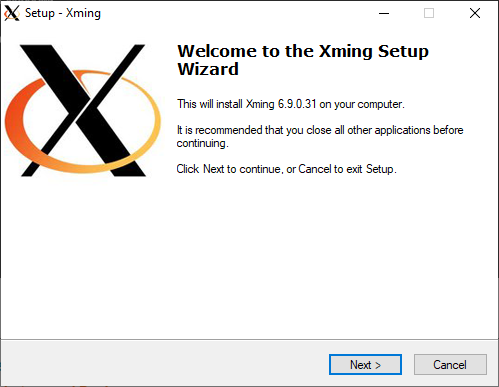
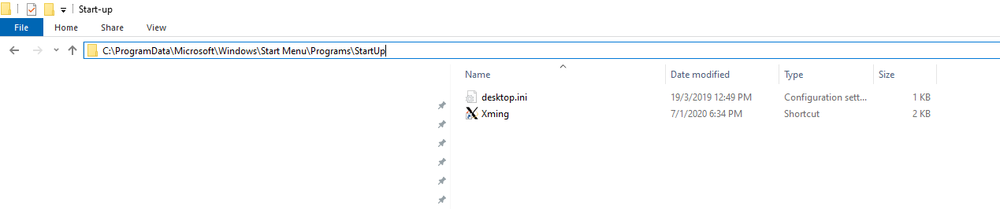
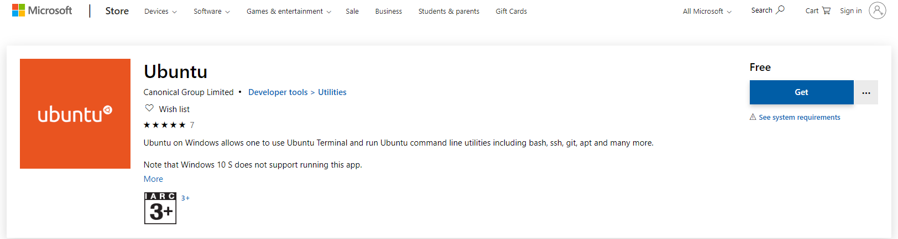
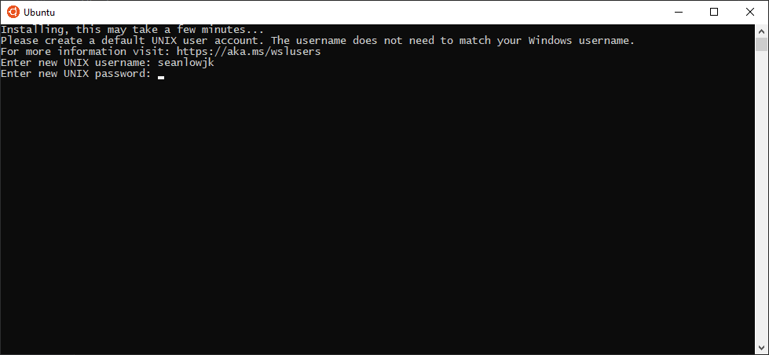
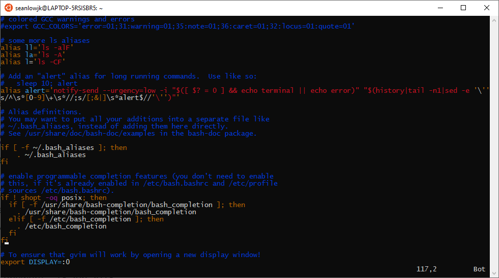

<frontmatter>
  pageNav: 2
  header: header.md
  footer: footer.md
  siteNav: site-nav.md
</frontmatter>

<br> 

# Setting Up Lab Environment 
<br>

From this tutorial, you should be able to set-up a Unix-like environment to simulate the actual Command-Line Interface (CLI)  
you face in CS2030 during your lab sessions. 

<box type="warning">
    This only applies to Windows Users. <br/> 
    If you are a Mac User, you can use your terminal. But do remember to have <a href="settingUpJava.html">jdk-11 installed</a>!
</box>

<panel header="## Setting Up Windows Subsystem for Linux (WSL)" no-close>

1) Go to Settings. 



2) Go to Apps. 



3) Under Programs and Features, click the Turn Windows features on or off option. 


4) Tick the checkbox beside Windows Subsystem for Linux. It will prompt you to restart your computer. 



5) Congratulations! You have installed WSL for Your Windows Computer!

</panel> 

<panel header="## Downloading XMing for gVim" no-close>

<box type="warning">
    As gVim is a Graphical User Interface (GUI) application, you would need someone else 
    other than a Linux Subsystem to open gVim. <br />
    This is when XMing comes in handy!
</box>

1) Go to [this link](https://sourceforge.net/projects/xming/) and download XMing Installer. 


2) Open the .exe file and follow the setup.  



3) To make sure the XMing server runs everytime you startup your computer, add a XMing,.exe shortcut to this directory: <br /> 
```C:\ProgramData\Microsoft\Windows\Start Menu\Programs\StartUp```


<br />

4) It should appear under your StartUp Apps. 


5) Do make sure to **restart** your computer after following this section. 

</panel> 

<panel header="## Downloading and Setting Up Ubuntu" no-close>

1) Go to [this link](https://www.microsoft.com/en-sg/p/ubuntu/9nblggh4msv6?activetab=pivot:overviewtab) and download the 
Ubuntu Installer! Once it has finished download, launch the application. 



2) Once you have launched the application, key in a new Unix username and password. Please remember this password 
as you would need this to download packages for installation later!



3) Unfortunately, you will need to install the jdk package onto your Ubuntu environment. <br /> 
To do so, type in ```sudo apt install openjdk-11-jdk-headless```. 


4) As gVim is not installed on your Ubuntu environment, you would need to install it yourself. <br /> 
To do so, type in ```sudo apt update```, followed by ```sudo apt install vim-gnome```. 

5) Type in ```vim .bashrc``` and add the last line to your ```.bashrc``` file. 



6) Once done, exit the file and restart the Ubuntu application. 

7) Now, gVim should work whenever you use the ```gvim``` command. 

</panel> 

<panel header="## Setting up your .vimrc file" no-close>

1) You can change your ```.vimrc``` file configurations to suit your needs. 

2) Below is a sample ```.vimrc``` file configration provided for you. 

```
filetype plugin indent on
set lbr nu et ts=4 sw=4 ai si sc bs=2 wb nobk vb so=1 ru ls=2
set ww=b,s,h,l,<,>,[,]
set clipboard=autoselect,exclude:.*
set fo+=r
syn on
```

3) To do so, type in ```vim .vimrc```, change the configurations and save using ```:wq```. 


</panel>

<br /> 

If you follow all these instructions carefully, you should be able to access your files at this directory: <br /> 
```C:\Users\%USERNAME%\AppData\Local\Packages\CanonicalGroupLimited.UbuntuonWindows_79rhkp1fndgsc\LocalState\rootfs\home```
