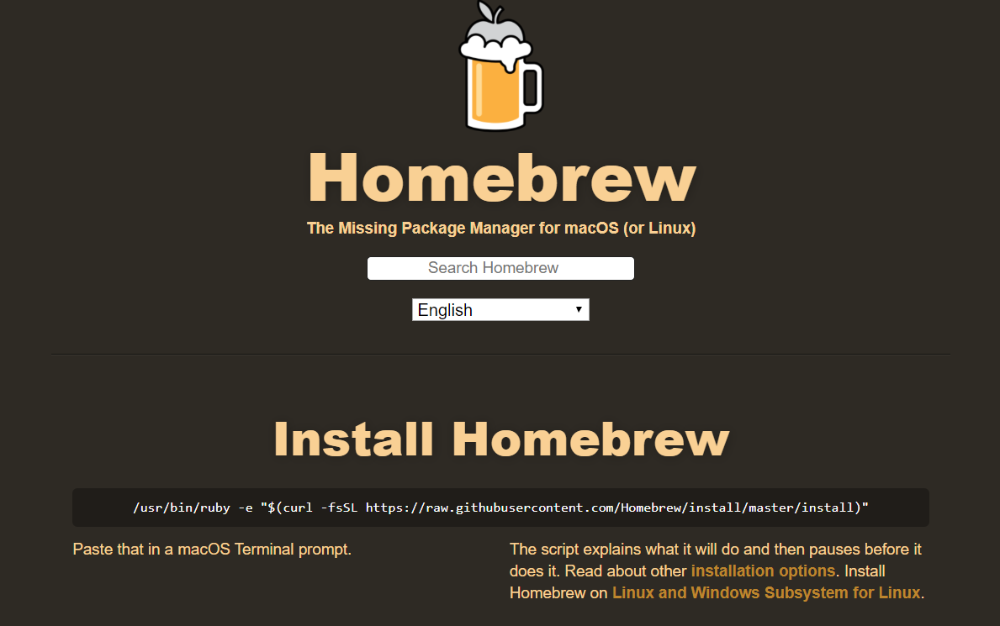

<frontmatter>
  pageNav: 2
  header: header.md
  footer: footer.md
  siteNav: site-nav.md
</frontmatter>

<br> 

# Setting Up MacVim

<br>

<box type="warning">
    This only applies to Mac Users. <br/> 
    For Windows Users, please refer to <a href="settingUpVim.html">here</a>! 
</box>
 
1) Go to the homebrew website from [here](http://brew.sh) <br /> 


<br />

2) Go to Terminal and paste this following command: <br /> 
```/usr/bin/ruby -e "$(curl -fsSL https://raw.githubusercontent.com/Homebrew/install/master/install)"``` 
3) Type in ```export PATH=/usr/local/bin:$PATH```.
4) Type in ```brew update```.
5) Type in ```brew install vim && brew install macvim```.
6) Type in ```brew link macvim```.
7) From there, you should be able to use MacVim via the command ```mvim```.

<br /> 