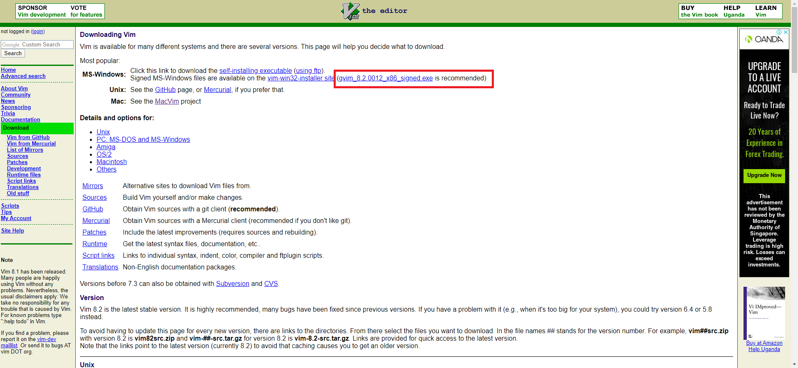
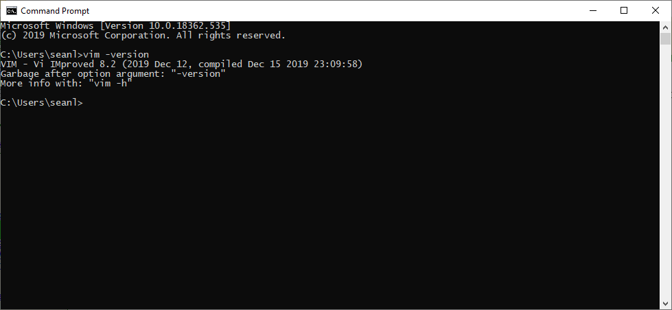

<frontmatter>
  pageNav: 2
  header: header.md
  footer: footer.md
  siteNav: site-nav.md
</frontmatter>

<br> 

# Setting Up Vim

<br>

<box type="warning">
    This only applies to Windows Users. <br/> 
    If you are a Mac User, you will most likely have Vim pre-installed. 
</box>

1) To download the vim installer, go to the link [here](https://www.vim.org/download.php)



2) Follow the instructions in the installer. 


3) To check if you have vim installed, simple type ```vim -version``` on your terminal. 

