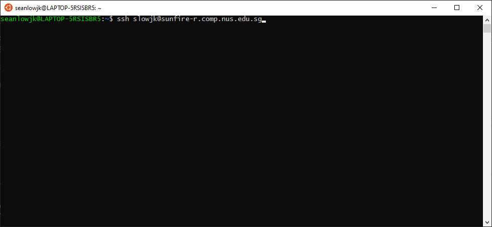
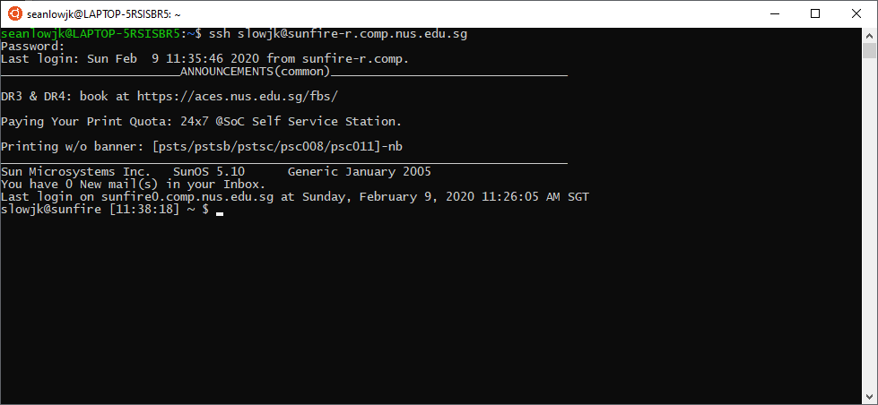
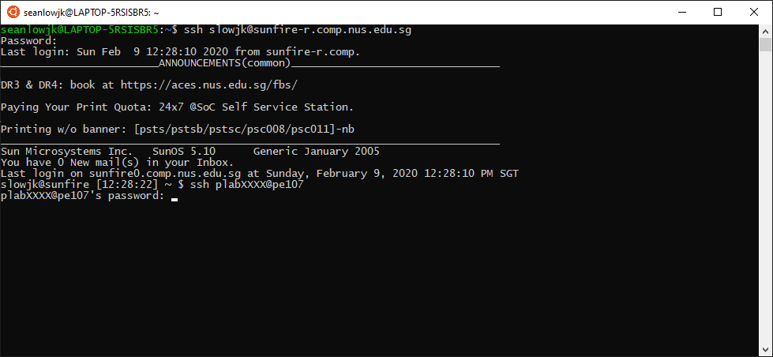
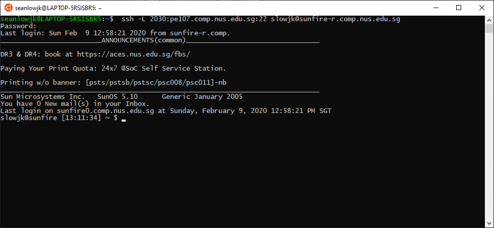
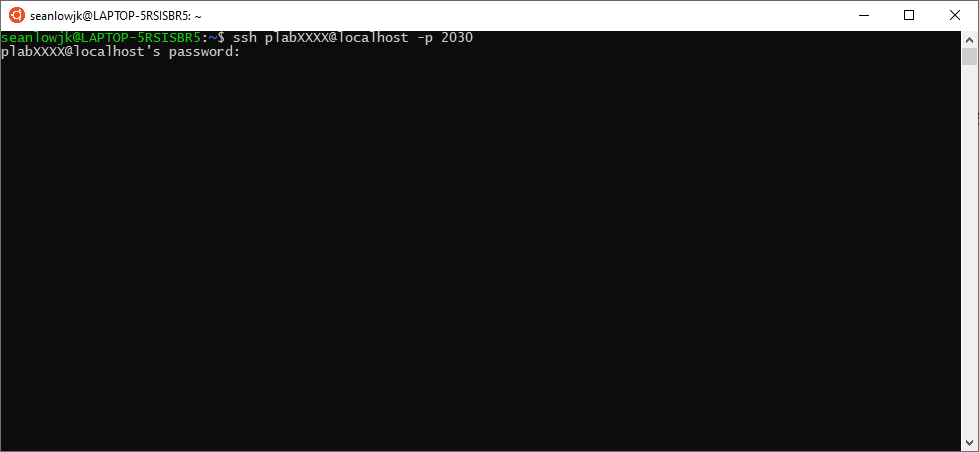
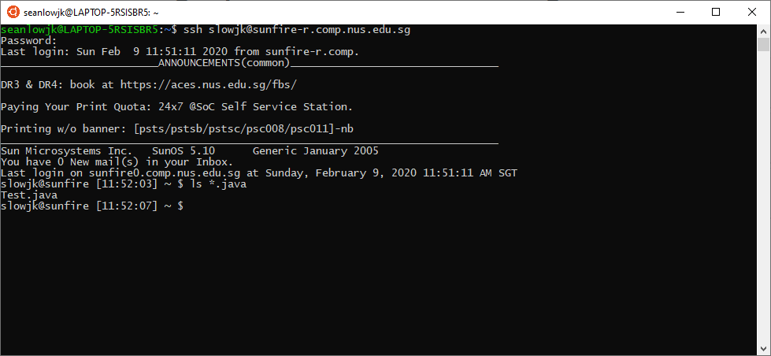
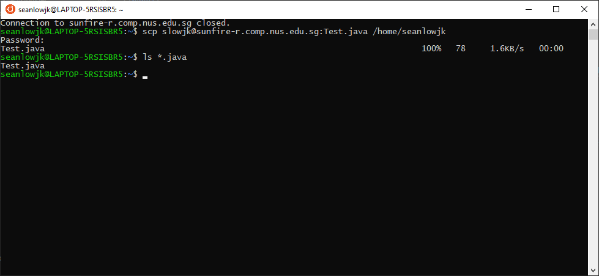

<frontmatter>
  pageNav: 2
  header: header.md
  footer: footer.md
  siteNav: site-nav.md
</frontmatter>

  

# Setting Up Sunfire and Accessing PE Nodes

 

From this tutorial, you should be able to access the PE nodes via Sunfire via SSH. 

<panel header="## Basic Requirements" no-close>

1. You will need to have an SoC UNIX Account. If you do not have an SoC UNIX Account, please apply for it [here](https://mysoc.nus.edu.sg/~newacct/)

2. Once you have an SoC UNIX Account, you will need to enable access to the SoC Compute Cluster [here](https://mysoc.nus.edu.sg/~myacct/services.cgi)

3. You will then need an `ssh` client. For Wndows Users, you should have set up Windows Subsystem for Linux. You can find the link [here](https://nus-cs2030.github.io/1920-s2/contents/guides/settingUpLabEnv.html)

4. Alternatively, if you wish to have a Graphical User Interface (GUI), you can download either [XShell with Xftp](https://www.netsarang.com/en/free-for-home-school/), [PuTTY](https://www.putty.org/). **Do note that only Windows Users are able to install XShell or PuTTY.**

</panel>

<panel header="## SSH into PE Nodes Using Terminal" no-close>

**The Following Insturctions can be done in both Windows and Mac Terminals.**

1. To SSH into the sunfire remote server, type in `ssh YOUR_UNIX_SIC_USERNAME@sunfire-r.comp.nus.edu.sg`. The Username should have be your **SoC UNIX Account Usernane.** 

From there, you should be able to see this screen. 

2. To then access the pe-nodes when they are up, do the same thing. Type in `ssh plabXXXX@peYYY` where XXXX and YYY are your userid and hostname given to you by the account slip respectively. 

3. Once done, you are able to access the files. 

4. If you wish to exit, please type in the `exit` command. **DO NOT** close your terminal without exiting from the remote server. 

</panel>

<panel header="## SSH into PE Nodes Using Port Forwarding" no-close>

Alternatively, You can use SSH Tunnels via Port Forwarding.

1. Local port forwarding means that a port of the SSH client (your machine) is forwarded to the SSH server (`sunfire.comp.nus.edu.sg`), which opens a connection to a preset destination server (e.g. `pe107`). This method causes the host to seem as if it is hosted on a local port, e.g. `localhost:PORT_NUMBER`. 

2. To use local port forwarding, execute the following command:   `ssh -L PORT_NUMBER:peYYY.comp.nus.edu.sg:22 YOUR_UNIX_SIC_USERNAME@sunfire-r.comp.nus.edu.sg` 
  where the `PORT_NUMBER` has to be defined by you. (e.g: 2030) and `peYYY` is the hostname mentioned in your plab slip.

3. Following which, you will need to to open a separate SSH connection from your machine to `localhost` at port `PORT_NUMBER` which you defined earlier. THis can be done via the following command:   `ssh plabXXXX@localhost -p PORT_NUMBER` where `plabXXXX` is the userid given to you in your plab slip and `PORT_NUMBER` is the port number which you defined earlier. 

</panel>

<panel header="## Getting files from Remote Server to Local Server" no-close>

1. For example, if you wish to retrieve files from sunfire to your local directory or vice versa, you can use the `scp` command. 

2. There are a few commands that you will need to learn to copy files. These can all be found [here](https://haydenjames.io/linux-securely-copy-files-using-scp/).

3. For example, I would wish to transfer `Test.java` from sunfire into my local directory: 

I would need to use the following command: `scp (YOUR_UNIX_SOC_USERNAME)@sunfire-r.comp.nus.edu.sg:Test.java /home/seanlowjk` 

4. From here, you should be able to view it inside your local directory. 

</panel>