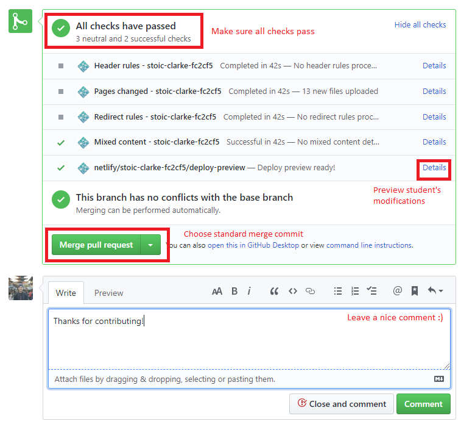

# Instructions for TAs

## Approving PRs
1. Review student's pull request and ensure that content is relevant and the right files are modified under "Files Changed". The right directory should be `/contents` and not `/_site`.
2. Check for formatting (WIP).
3. If required, leave comments to ask student to fix certain issues. 
4. Merge pull request!
   


## Formatting Standard

(WIP)

## Enabling Navigation
(Aiming to script this process eventually)
1. Clone the repo to your local computer.
2. In the student's markdown, ensure that the Navbar, heading and edit links are included. E.g.:
    ```markdown
    <frontmatter>
    pageNav: 2
    header: header.md
    footer: footer.md
    siteNav: site-nav.md
    </frontmatter>

    <br> 

    # Tell, Don't Ask
    <hr>

    <!-- DO NOT DELETE THIS LINK AND PLEASE WRITE BELOW THIS LINK-->
    [Edit the material here! :fas-pen:](https://github.com/nus-cs2030/1920-s2/edit/master/contents/textbook/lecture01/tellNotAskAndPrivateAccessModifiersSummary/index.md)
    <!-- DO NOT DELETE THIS LINK AND PLEASE WRITE BELOW THIS LINK-->

    ### 
    ```
3. Add the link to the student's new document within textbook.md accordingly:
    ```
    * [Introduction to Imperative Programming](lecture01/imperativeProgramming/imperativeProgramming.html) 
    * [Abstraction](lecture01/abstraction/abstraction.html) 
    * [new document title](lecture01/newPR/newPR.html)
    ```
4. Commit and push your files after building and testing it locally. 
5. Go to commits and click the yellow dot > details to see your progress.
   
   

6. Wait for Travis CI to run checks and push your changes to the gh-pages branch.
   
   

7. You should see it live on the GitHub page!