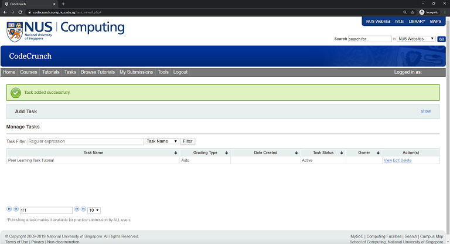
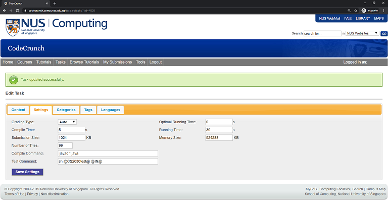
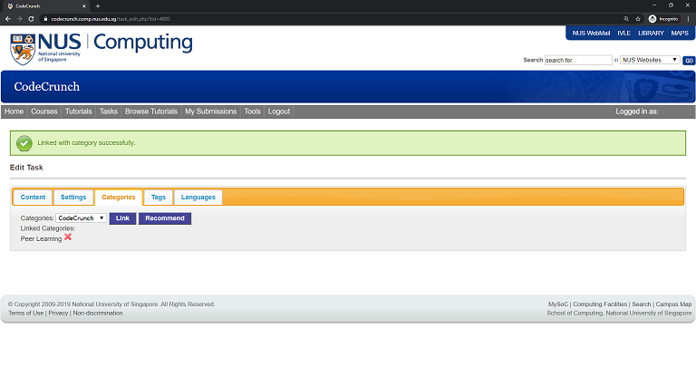

<frontmatter>
  pageNav: 2
  header: header.md
  footer: footer.md
  siteNav: site-nav.md
</frontmatter>

<br> 

# Peer Learning Task Creation using Codecrunch

Link to [Codecrunch](https://codecrunch.comp.nus.edu.sg/index.php) is here!

<br>

<panel header="## Task Creation" no-close>

Creating a task for CodeCrunch involves the following steps:

* Think of the problem statement
* Creating the solution
* Creating input/output files
* Preparing your files for upload
* Upload to CodeCrunch and write the task description
* Test your task

</panel>

<panel header="## Think of the Problem Statement" no-close>

You first need to decide on the statement of the problem. <br> 
This could be in the form of testing a particular concept taught in class, 
or solving a full-fledged problem. You will also need to decide on how the program is to be tested, 
either using jshell, by running the program via input/output, or both.

</panel>

<panel header="## Creating the Solution" no-close>

Let's use the following as the solution of a task. 
You may create as many class files as you like, but do note that if you wish to test program input/output via a main 
method, this method must reside in the Main class.

```java
import java.util.Scanner;

class Main {

    static String read() {
        System.out.print("What's your name? ");
        return new Scanner(System.in).next();
    }

    static String hello(String name) {
        return "Hello " + name;
    }

    public static void main(String[] args) {
        System.out.println(hello(read()));
    }
}

```

After a successful compilation,

```shell script
javac Main.java
```

think of what you want to set as tests. In the above, you can either

* test a method using jshell

```jshelllanguage
$ jshell Main.java
jshell> Main.hello("Mickey")
$.. ==> "Hello Mickey"


jshell> /exit
|  Goodbye
```

* run the program via input/output

```jshelllanguage
$ java Main
What's your names? Mickey
Hello Mickey
```

Before proceeding, compile your solution, test and run your program to make sure that you have a working solution.

</panel>


<panel header="## Creating Test Input/Output Files" no-close>

In order to make your program available for your peers to practise, you need to also provide input/output files. 
Let's use the same two test examples above.

The input file is simply the input that a human user will type during testing. 
For jshell testing, name your input file ending with a .jsh extension. 
On the other hand for input/output testing, name your input file ending with a .in extension.

* for jshell testing (e.g. test1.jsh), There is no need to specify the java files to be opened.

```shell script
Main.hello("Mickey")
/exit
```

* for input/output testing (e.g. test2.in), 

```shell script
Mickey
```

Using the input files, you can redirect the output of the test to the corresponding output file. These files should end with .out extension.

* for jshell testing, say using test1.jsh

```shell script
jshell -q Main.java < test1.jsh | dos2unix > test1.out
```

* for input/output testing, say using test2.in

```shell script
java Main < test2.in | dos2unix > test2.out
Mickey
```

Take note of the following:

* If you would like to replace an output file that has been generated previously, force the redirection by using >| instead of >
* dos2unix is necessary to deal with Windows line endings, particularly if you are generating the files on a Windows machine.
* Note that the naming for each input/output pair must be consistent (excluding the file extension), 
say test1.jsh goes with test1.out, test2.in goes with test2.out, etc.

You may also create as many tests as you like. To maintain some ordering to your tests, 
it is advisable to keep to the same naming convention, but add a running suffix, e.g. test1..., test2..., test3..., etc.

<box type="warning">
    jshell tests are a little tricky due to the running numbers while executing the jshell script, 
    which may be different depending on how the program is written. <br><br>
    As such, we need to remove the running numbers from the generated output file. <br><br>
    One way is to open the output file in vim, go to the start of every line that begins with $xx ==>, 
    and then type 2dw in vim's command mode. You can just do it for the first occurrence, and for each subsequent occurrence, 
    repeat the previous operation by typing .<br><br>
    Another way is to pipe the output from the test through sed
    
    jshell -q Main.java < test1.jsh | dos2unix | sed s/^.*==\>/==\>/g > test1.out
</box>

</panel>

<panel header="## Preparing Your Files for Upload" no-close>

You should now have the java source files, input and output files. You will need to create three directories:

* solution: move your .java files into this directory
* input: move your input files (.jsh and .in) into this directory
* output: move your output files (.out) into this directory

The file directoy structure will look something like this:

```shell script
$ ls *
Main.class

input:
test1.jsh  test2.in

output:
test1.out  test2.out

solution:
Main.java
```

Now zip the three directories using your favourite zip utility. For example, using zip in unix/linux:

```shell script
$ zip -r hello.zip input output solution
  adding: input/ (stored 0%)
  adding: input/test1.jsh (stored 0%)
  adding: input/test2.in (stored 0%)
  adding: output/ (stored 0%)
  adding: output/test1.out (deflated 21%)
  adding: output/test2.out (stored 0%)
  adding: solution/ (stored 0%)
  adding: solution/Main.java (deflated 45%)

$ ls *
hello.zip   Main.class

input:
test1.jsh  test2.in

output:
test1.out  test2.out

solution:
Main.java
```

</panel>

<panel header="## Upload to CodeCrunch" no-close>

Now, log in to CodeCrunch. You have been given superuser access to the course CS2030P in order to create tasks.

1. Click on the Tasks tab
2. Under the Add Task section, click show
3. Add a new Task Name (to be consistent, the task name should begin with CS2030 Peer Learning: your task name) and click Add Task. 

<br>

Notice that your task is now listed in the task list under Manage Tasks



4. From the task list, click Edit to edit your task
5. Under the Content tab, click BROWSE, select your zip file, and click Upload
6. You can now include a meaningful task description in the Content box (a embedded html editor)
7. Remember to click Save Changes (best to do it periodically)


</panel>

<panel header="## Test your Task" no-close>

Before making the task available for your peers, you should test it at least once.

* Go to the Settings tab and enter the following for the Compile and Test commands:
    * Compile command: javac *.java
    * Test command: sh @CS2030test@ @IN@
* If you have jshell tests, you will also need to set the Running Time to around 20 to 30 seconds.
* Remember to click Save Settings



Now click on the Tasks tab again, and click View. Upload your solutions the usual way, and view you submission to see if everything works.

</panel>


<panel header="## Final Step!" no-close>

When you are ready to release your task in the course CS2030, edit your task again, 
and click the Categories tab. Select Peer Learning and click Link.



CodeCrunch has been set to periodically look for new tasks with the Peer Learning category and link them to the main CS2030 course. 
Once linked, you are still allowed to update your task, if deemed necessary.

</panel>

