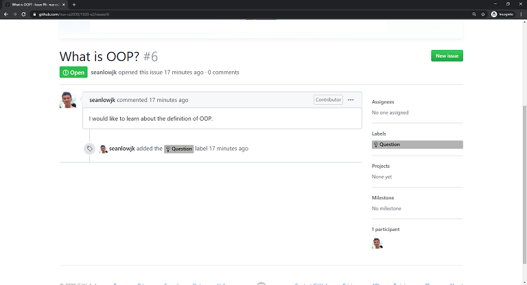
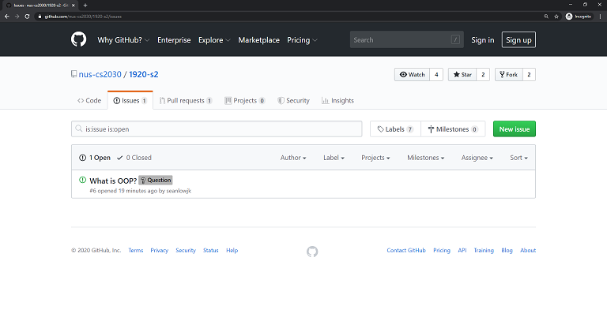
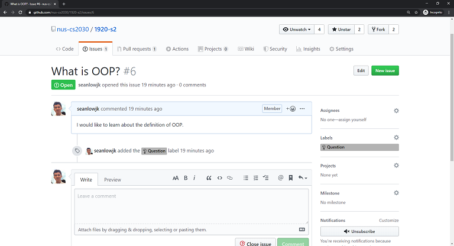

<frontmatter>
  pageNav: 2
  header: header.md
  footer: footer.md
  siteNav: site-nav.md
</frontmatter>

  

# Textbook Contributions

Below is the tutorial on how you can make contributions to our CS2030 Collaborative Textbook using Github.
We will be using markdown for the Collaborative Textbook. 

Click [here](https://github.com/adam-p/markdown-here/wiki/Markdown-Cheatsheet) or 
[here](https://guides.github.com/pdfs/markdown-cheatsheet-online.pdf) for a simple Markdown cheatsheet!

<box type="warning">
    This is a beginner's guide to the forking workflow!   
    If you had prior experience to using Github, this might not be the tutorial for you. <i class="fas fa-frown"></i>
</box>

<panel header="## Step 0: Signing Up for Github" no-close>

Please Sign Up for Github if you have not done so!

</panel>

<panel header="## Step 1: Adding an Issue to the repository" no-close> 

If you have seen a contribution that has not been made, you can add an issue [here](https://github.com/nus-cs2030/1920-s2/issues). 

Be sure to give it the following: 

1) A suitable Title. 
2) A suitable Description. 
3) Tags (if necessary).

Our Teaching Staff would then give a suggestion on where you can make this contribution within the textbook. 

</panel> 

<panel header="## Step 2: Searching For Issues to the Repository" no-close> 

To Look for Contributions that you can make, go to [this link](https://github.com/nus-cs2030/1920-s2/issues) to find 
an issue which was raised by the Teaching Staff / Your Fellow Peers. 

  

From there, you should be able to see what kind of contribution you can make to the textbook. 

</panel> 

<panel header="## Step 3: Finding the section to edit" no-close>

While navigating through the [textbook](https://nus-cs2030.github.io/ay1920-s2/contents/textbook/textbook.html), 
you can click on any of the pen icons to edit the page. 

</panel>

<panel header="## Step 4: Forking the Repository" no-close>

It will direct you to the Github Repository of this website. From there, you are required to create a fork of the 
repository. 

</panel>

<panel header="## Step 5: Editing using the Markdown editor" no-close>

You will then create a fork of this repository. Use the Markdown editor to make whatever changes you need to make 
to that particular section! Try to add in useful information here which is covered / not covered in lectures!

</panel>

<panel header="## Step 6: Save your file changes" no-close>

Once done, save and commit your file changes!

</panel>

<panel header="## Step 7: Create your Pull Request" no-close>

It will now bring you back to the main repository of the website. As a result, you can create
your own pull request to make a contribution to the website. 

From which, you are required to name your Pull Request in the following format:  (full-name) : (Name of PR)

</panel>

<panel header="## Step 8: View your website changes" no-close>

Once you have submitted your Pull Request, you can view the changes you have made in a preview website using Netlify!  

Now, you would have to wait for your Pull Request to be merge in order to gain points for your contribution! 
</panel>

<panel header="## Step 9: Fixing Merge Conflicts" no-close>

<box type="info">
    Merge conflicts happen when you merge branches that have competing commits due to the clashes in content, 
    and Git needs your help to decide which changes to incorporate in the final merge.   
    This will most likely happen when you try to edit a file someone has already edited before. 
</box>

In the event that you have merge conflicts in the file, you are required to resolve them in the event that a Lab TA 
has not done so. 

You are required to make the necessary changes so that the merge conflicts are resolved.   

<box type="warning">
    Not deleting the arrows and equal signs might cause an error in the compilation process. 
</box>

Once you are done, you can Mark this merge conflict as resolved. 

Following which, you can commit this merge.

</panel>

  