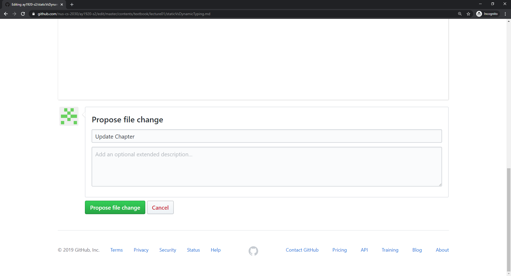
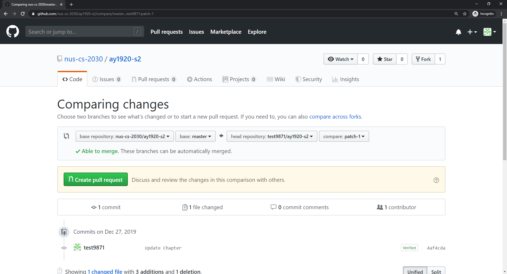
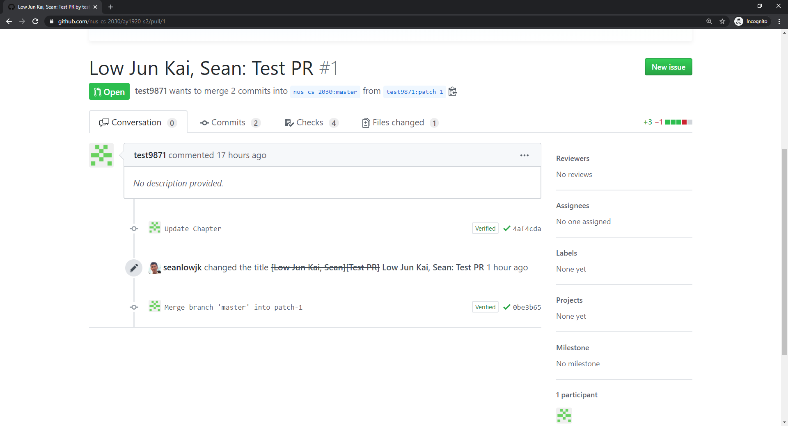
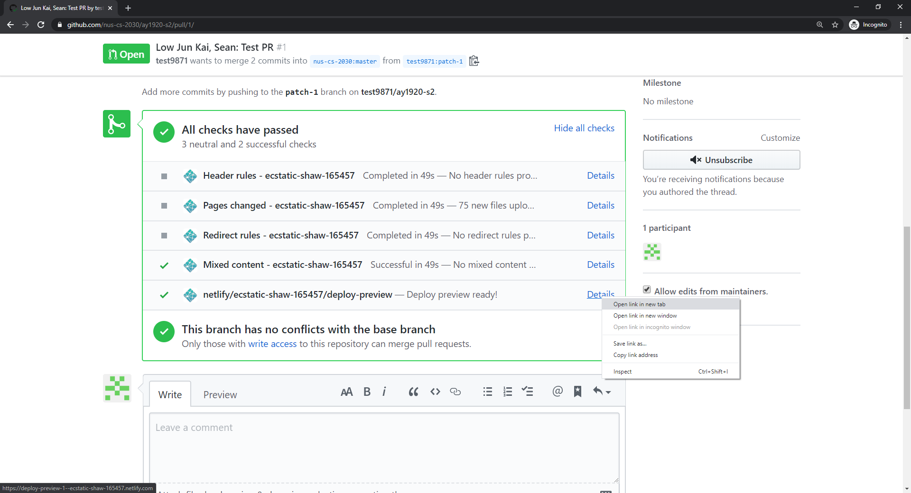
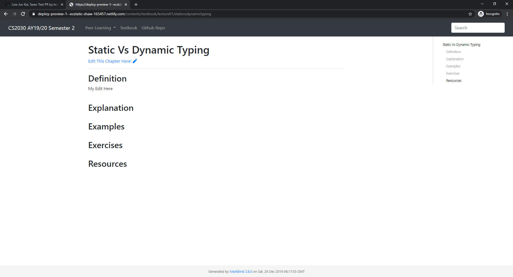

<frontmatter>
  pageNav: 2
  header: header.md
  footer: footer.md
  siteNav: site-nav.md
</frontmatter>

  

# Textbook Contributions

Below is the Tutorial on how you can make contributions to our CS2030 Collaborative Textbook Using Github.
We will be using markdown for the Collaborative Textbook. 

<box type="warning">
    Please ensure that you have created a Github Account before making any contribution.
</box>

## Tutorial 

<panel header="Step 1: Forking the Repository" no-close>

By Clicking on the pen icon in the textbook, it will bring you to this website where you can fork the repository to
make changes to the page of the textbook. 

</panel>

<panel header="Step 2: Making Changes Using Markdown editor" no-close>

You are allowed to make changes to the content of the page using the markdown editor provided in Github. 

</panel>

<panel header="Step 3: Propose the file change " no-close>

Once done, you can name your commit and propose the file change.

</panel>

<panel header="Step 4: Create the Pull Request" no-close>

You can then create a new Pull Request 

</panel>

<panel header="Step 5: Naming Protocol" no-close>

Name your Pull Request in the form of <Full Name>: <PR Name> so that our scripts can award you credit for 
the peer learning segment. 

</panel>

<panel header="Step 6: Website Preview" no-close>

After Submitting your Pull Request, you can view the website with your proposed edits. 

</panel>

<panel header="Step 7: Finding the Changes " no-close>

You can browse through the temporary website to see your prposed edits. 

</panel>
